# Texture-Segmentation
Volumetric Texture Segmentation by Discriminant Feature Selection and Multiresolution Classification

<h1>
Volumetric Texture Segmentation by Discriminant Feature Selection and Multiresolution Classification.  
</h1> 

<h2>Constantino Carlos Reyes-Aldasoro 
Abhir Bhalerao</h2>

    Test data, Matlab code and data sets and user manuals
    

 
<h3>
    
<b>Reyes-Aldasoro,
C.C.</b>, and A. Bhalerao, Volumetric
Texture Segmentation by
Discriminant Feature Selection and Multiresolution Classification,
<a
href="http://ieeexplore.ieee.org/document/4039538/">
IEEE Trans. on Medical Imaging</a> (2007) Vol. 25, No. 1, pp.
1-14. 
<b>Reyes-Aldasoro, C.C.</b>, and A.
Bhalerao, The Bhattacharyya space for
feature selection and its
application to texture segmentation, <a
href="http://dx.doi.org/10.1016/j.patcog.2005.12.003">Pattern
Recognition</a>, (2006) Vol. 39, Issue 5, May 2006, pp. 812-826.    
</h3>

<h2>Abstract</h2>
Texture analysis in 2D has been well studied, but many 3D applications
in
Medical Imaging, Stratigraphy or Crystallography, would beneit from 3D
analysis instead of the traditional, slice-by-slice approach. In this
paper a Multiresolution Volumetric Texture Segmentation (M-VTS)
algorithm is presented. The method extracts textural measurements from
the Fourier domain of the data via subband filtering using an
Orientation Pyramid [1]. A novel Bhattacharyya space, based on the
Bhattacharyya distance is proposed for selecting the most discriminant
measurements and producing a compact feature space. Each dimension of
the feature space is used to form the lowest level of a Quad Tree. At
the highest level of the tree, new positional features are added to
improve the contiguity of the classification. The classified space is
then projected to lower levels of the tree where a boundary refinement
procedure is performed with a 3D equivalent of butterfly filters. The
performance of M-VTS is tested in 2D by classifying a set of standard
texture images. M-VTS yields lower misclassification rates than reported
elsewhere [2], [3], [4]. The algorithm was tested in 3D with artificial
isotropic data and three Magnetic Resonance Imaging sets of human knees
with encouraging results. The regions segmented from the knees
correspond to anatomical structures that could be used as a starting
point for other measurements. By way of example, we demonstrate
successful cartilage extraction.  

 Keywords: Volumetric texture,
Filtering, Multiresolution, Texture Segmentation, Feature Selection

 IMPORTANT 

 Many of these routines were developed some time ago, that is many versions of Matlab have gone through. Some m-files were not 
    available from Matlab at that time (like mode) and thus I created my own. Be careful as some routines may not be compatible with
    the most recent versions of Matlab.

  
<h2>Data and programs: everything is in <a href="http://www.mathworks.com">matlab</a>  format.
</h2>

 

 
Data 
 

<table align="center" border="1" cellpadding="2" cellspacing="2"
 width="80%">
<tbody>
<tr>
<td><i>File 
</i> </td>
<td valign="top"><i>Description 
</i> </td>
<td valign="top"><i>Image  
</i> </td>
</tr>
<tr>
<td valign="top" width="20%">orient3dcube 
</td>
<td valign="top">Two oriented patterns of 64 x 32 x 64 elements
each, with different frequency and orientation. The file contains two
matrices: 
data  -  64x64x64 original data,  Features can be
extracted
from here, and 
dataFeats - two filtered features  
</td>
<td valign="top" width="20%">
      
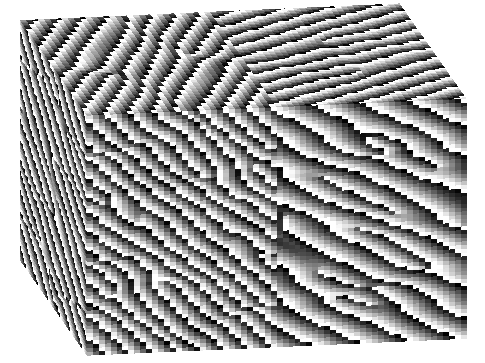
 
</td>
</tr>

<tr>
<td valign="top" width="20%">gauss3dcube 
</td>
<td valign="top">Two bi-variate Gaussian distributions of size 32
x 32 x 32 pixels with similar means and variances, each with dimensions
32 x 16x 32. This are considered as features for the classification
process. 
 
A mask for this data can be created by: 
mask=ones(32,32,32); 
mask(:,1:16,:)=2; 
</td>
<td valign="top" width="20%">

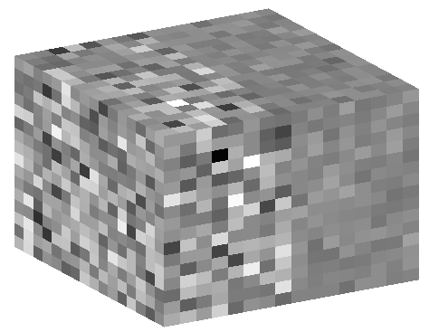
 
</td>
</tr>
<tr>
<td valign="top" width="20%">figure11f 
</td>
<td valign="top">Just one of the figures with different textures,
the whole set, with training data if needed is available at Trygve
Randen's webpage: 
 
<a href="http://www.ux.uis.no/%7Etranden/">http://www.ux.uis.no/~tranden/</a> 
</td>
<td valign="top" width="20%">

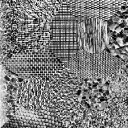
 
</td>
</tr>
<tr>
<td valign="top">mask 
</td>
<td valign="top">16 class mask for the figure above 
</td>
<td valign="top">

 
</td>
</tr>
<tr>
<td valign="top">
       Phantom 
       Phantom Mask 

</td>
<td valign="top">A 64 x 64 x 64 phantom of artificial textures 
</td>
<td valign="top">

 
</td>
</tr>
</tbody>
</table>

 

 
Main Programs 
 

<table align="center" border="1" cellpadding="2" cellspacing="2"
 width="80%">
<tbody>
<tr>
<td valign="top"><i>File 
</i> </td>
<td valign="top"><i>Description 
</i> </td>
</tr>
<tr>
<td valign="top" width="20%">mVts</a> 
</td>
<td valign="top"> Multi-resolution Volumetric Texture
Segmentation main program 
This program Classifies in a hierarchical methodology that climbs 
over a Quad Tree up to a desired level (levsP), classifies with
extra positional features, and then propagates downwards with the 
boundaries filtered with Pyramidal butterfly filters  

</td>
</tr>
<tr>
<td valign="top" width="20%">sopy</a> 
</td>
<td valign="top">sopy transforms data into the Fourier Domain and
then 
filters it with a Second Orientation Pyramid tessellation 
with truncated Gaussians in different frequency-orientation positions
 
</td>
</tr>
<tr>
<td valign="top" width="20%">sopy3d</a> 
</td>
<td valign="top">3D version of the above 
</td>
</tr>
<tr>
<td valign="top" width="20%">kmeans_b</a> 
</td>
<td valign="top">k-means classifier 
</td>
</tr>
</tbody>
</table>

 
Other Programs  
(subroutines) 
 
<table align="center" border="1" cellpadding="2" cellspacing="2"
 width="80%">
<tbody>
<tr>
<td valign="top"><i>File 
</i> </td>
<td valign="top"><i>Description 
</i> </td>
</tr>
<tr>
<td valign="top" width="20%">arrangeData</a> 
</td>
<td valign="top">Rearrangement of data from several formats to 2D
[RCL x numFeats] 
RCL=number of Rows * number of
Columns * number of Levels 
numFeats= number of features  
</td>
</tr>

<tr>
<td valign="top" width="20%">bhattaM</a> 
</td>
<td valign="top">Bhattacharyya Measurement Calculation 
</td>
</tr>

<tr>
<td valign="top" width="20%">expandu</a> 
</td>
<td valign="top">Quad Tree expansion 
</td>
</tr>
<tr>
<td valign="top" width="20%">gaussF</a> 
</td>
<td valign="top">GAUSSF produces an N-dimensional gaussian
function (N=1,2,3) 
</td>
</tr>
<tr>
 <td>ndgauss_r.m</a> </td>
 <td>A Gaussian function for the filters </td>
</tr>
<tr>
<td>cTessel.m</a></td>
<td>Provides central Tesselation</td>
</tr>
<tr>
<td>qTessel.m</a></td>
<td>Provides Quadrant Tesselation</td>
</tr>

<tr>
<td>cDeTessel.m</a></td>
<td>Provides central De- Tesselation</td>
</tr>

<tr>
<td>qDeTessel.m</a></td>
<td>Provides Quadrant De- Tesselation</td>
</tr>

<tr>
<td valign="top" width="20%">im2colRed</a> 
</td>
<td valign="top">Rearrange image blocks into columns with only
some of the pixels 
</td>
</tr>
<tr>
<td valign="top">LBG.m</a> 
</td>
<td valign="top">Linde Buzo Gray vector quantising algorithm  
</td>
</tr>
<tr>
<td valign="top">minDist</a> 
</td>
<td valign="top">determines minimum distance and assign to a
class 
</td>
</tr>
<tr>
<td valign="top">normData</a> 
</td>
<td valign="top">normalises data by dividing over the std  
</td>
</tr>
<tr>
<td valign="top">normProb</a> 
</td>
<td valign="top">Normal Probability calculation 
</td>
</tr>
<tr>
<td valign="top">padData</a> 
</td>
<td valign="top">Padds data with the same values on the edges 
</td>
</tr>
<tr>
<td valign="top">pixvsn</a> 
</td>
<td valign="top">compares value of pixel versus neighbours and
change if necessary 
</td>
</tr>
<tr>
<td valign="top">reduceu</a> 
</td>
<td valign="top">Quad Tree reduction 
</td>
</tr>
<tr>
<td valign="top">surfdat</a> 
</td>
<td valign="top">Plots in several dimensions 
</td>
</tr>
<tr>
<td valign="top">surfSOP</a> 
</td>
<td valign="top">Display 2 levels of the SOP results 
</td>
</tr>
<tr>
<td valign="top">vol2col</a> 
</td>
<td valign="top">Rearrange volume blocks into columns in a
sliding fashion 
</td>
</tr>
<tr>
<td valign="top">mode</a> 
</td>
<td valign="top">Mode 
</td>
</tr>
<tr>
<td valign="top">setImod</a> 
</td>
<td valign="top">subroutine for reduceu and expandu 
</td>
</tr>
<tr>
<td valign="top">prod3d</a> 
</td>
<td valign="top">3D products 
</td>
</tr>
<tr>
<td valign="top">createButter</a> 
</td>
<td valign="top">Creates the butterfly filters 
</td>
</tr>

<tr>
<td valign="top">unSupMask</a> 
</td>
<td valign="top">for Unsupervised cases 
</td>
</tr>
<tr>
<td valign="top">hist2d</a> 
</td>
<td valign="top">histogram of 2D signals  
</td>
</tr>
</tbody>
</table>

<h2>A Graphic Example of Subband filtering</h2>

  
 
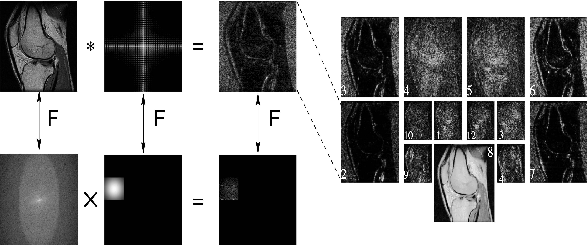
 
 
 
<h2>Results</h2>
 
 

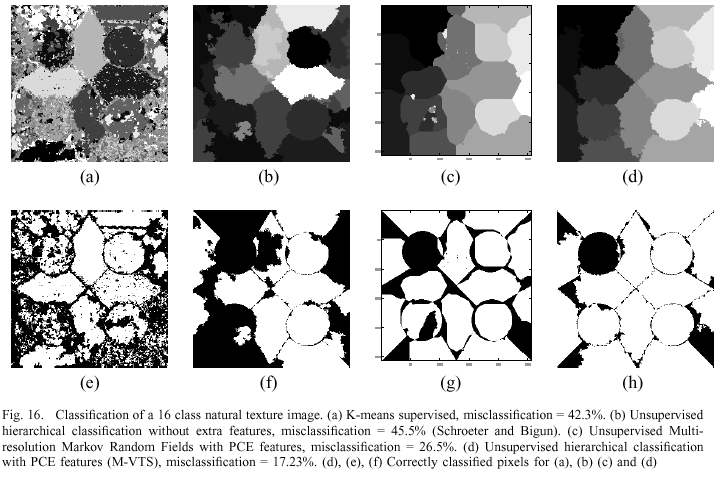
  

 
 
 
<table align="center" border="1" cellpadding="2" cellspacing="2"
 width="80%">
<tbody>
<tr>
<td valign="top" width="50%"> Original Images (from Randen) 
<a href="http://www.ux.uis.no/%7Etranden/">http://www.ux.uis.no/~tranden/</a>

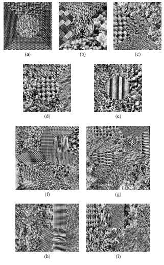
   
</td>
<td valign="top" width="50%"> Classification with M-VTS 

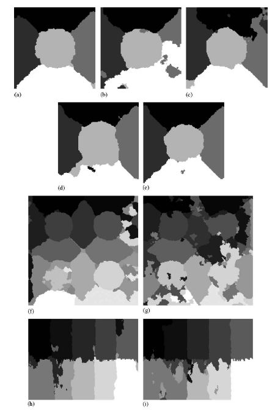
   
</td>
</tr>
<tr>
<td valign="top" width="50%">Boundaries imposed in the original
images 
 

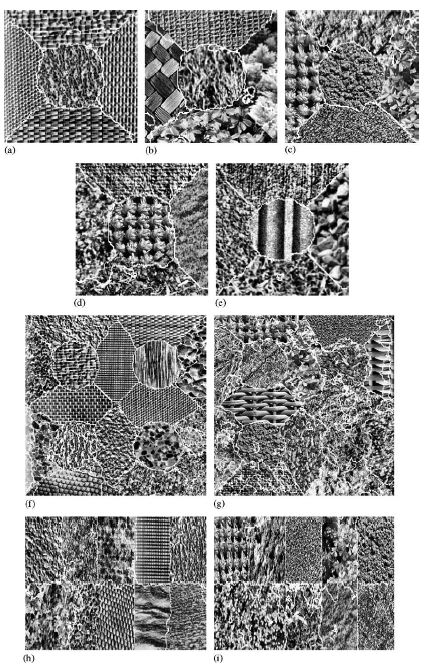
   
</td>
<td valign="top" width="50%">Correctly classified pixels in white 
 

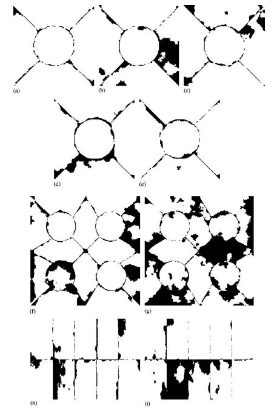
   
</td>
</tr>
</tbody>
</table>
 

  
 
<table border="1" cellpadding="2" cellspacing="2" width="80%">
<tbody>
<tr>
<td valign="top">

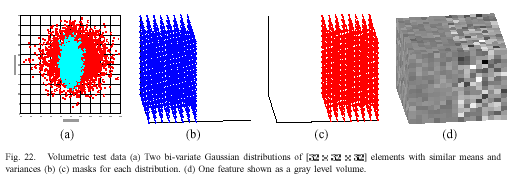
  
</td>
</tr>
<tr>
<td valign="top">

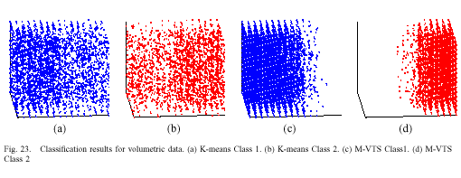
  
</td>
</tr>
<tr>
<td valign="top"> 

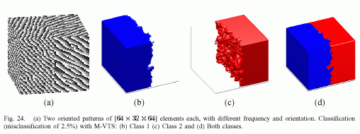
  
</td>
</tr>
</tbody>
</table>
 
 

 
 

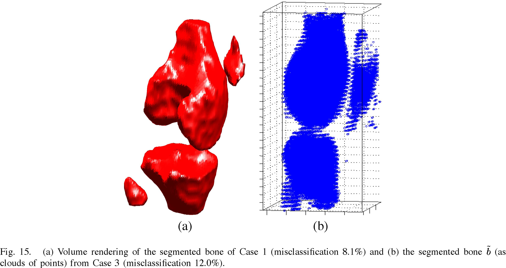
  
 

 
 
 

