# Texture-Segmentation

<h1>
Texture segmentation: an objective comparison between traditional and deep-learning methodologies <br>
</h1><br>


<p>
    Test data, Matlab code and data sets and user manuals

</p>

<br />
<h3>
    Paper submitted to Applied Sciences
</h3>

<h2>Abstract</h2>
This paper compares a series of traditional and deep learning methodologies for the segmentation of textures. Six well-known texture composites first published by Randen and Husoy were used to compare traditional segmentation techniques (co-occurrence, filtering, local binary patterns, watershed, multiresolution sub-band filtering) against a deep-learning approach based on the U-Net architecture. For the latter, the effects of depth of the network, number of epochs and different optimisation algorithms were investigated. Overall, the best results were provided by the deep-learning approach. However, the best results were distributed within the parameters, and many configurations provided results well below the traditional techniques.
</p>

<p> IMPORTANT </p>
<p>
</p>

<hr width="100%"> <br>
<h2>Data and programs: everything is in <a href="http://www.mathworks.com">matlab</a>  format.
</h2>


<h2>Short Tutorial</h2>


Filter the image figure11 with the SOP filtering up to the third level of the pyramid (21 features)

``` {.codeinput}
%% Clear all the data and close all windows
clear all
close all
```

Quad Tree: reduce and expand through the Quad Tree

``` {.codeinput}
                    figure11_1     = reduceu     (figure11);
                    [256x256]                            [512x512]

                    figure11_2     = reduceu     (figure11_1);
                    [128x128]                         [256x256]  

                    figure11_1b   = expandu     (figure11_2);
                    [256x256]                            [128x128]     
```


Display 2 levels of the pyramid (2:14) in figure 1

``` {.codeinput}
        surfSOP (figure11SOP (:,:,2:14), 1 );
```


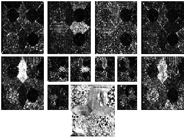


<br>
<div align="center"><br>
Data<br>
<br>
</div>
<table align="center" border="1" cellpadding="2" cellspacing="2"
 width="80%">
<tbody>
<tr>
<td><i>File<br>
</i> </td>
<td valign="top"><i>Description<br>
</i> </td>
<td valign="top"><i>Image <br>
</i> </td>
</tr>
<tr>
<td valign="top" width="20%">orient3dcube<br>
</td>
<td valign="top">Two oriented patterns of 64 x 32 x 64 elements
each, with different frequency and orientation. The file contains two
matrices:<br>
data  -  64x64x64 original data,  Features can be
extracted
from here, and<br>
dataFeats - two filtered features <br>
</td>
<td valign="top" width="20%">

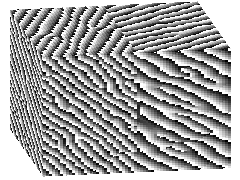
<br>
</td>
</tr>

<tr>
<td valign="top" width="20%">gauss3dcube<br>
</td>
<td valign="top">Two bi-variate Gaussian distributions of size 32
x 32 x 32 pixels with similar means and variances, each with dimensions
32 x 16x 32. This are considered as features for the classification
process.<br>
<br>
A mask for this data can be created by:<br>
mask=ones(32,32,32);<br>
mask(:,1:16,:)=2;<br>
</td>
<td valign="top" width="20%">

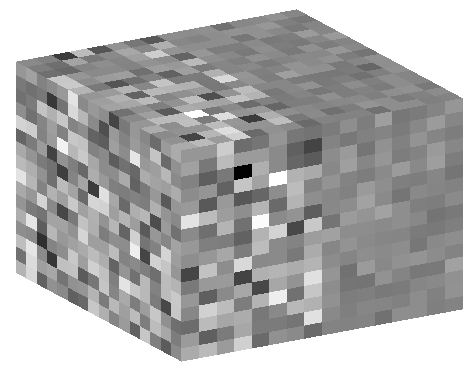
<br>
</td>
</tr>
<tr>
<td valign="top" width="20%">figure11f<br>
</td>
<td valign="top">Just one of the figures with different textures,
the whole set, with training data if needed is available at Trygve
Randen's webpage:<br>
<br>
<a href="http://www.ux.uis.no/%7Etranden/">http://www.ux.uis.no/~tranden/</a><br>
</td>
<td valign="top" width="20%">

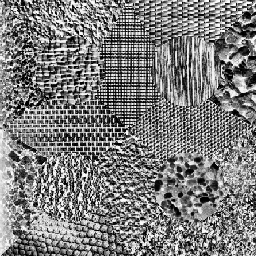
<br>
</td>
</tr>
<tr>
<td valign="top">mask<br>
</td>
<td valign="top">16 class mask for the figure above<br>
</td>
<td valign="top">

<br>
</td>
</tr>
<tr>
<td valign="top">
       Phantom<br>
       Phantom Mask<br>

</td>
<td valign="top">A 64 x 64 x 64 phantom of artificial textures<br>
</td>
<td valign="top">

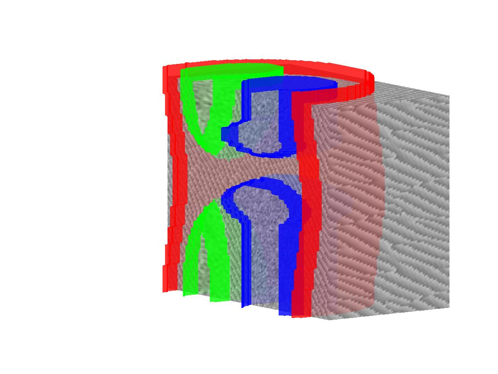
<br>
</td>
</tr>
</tbody>
</table>


<br>
<div align="center"><br>
Main Programs<br>
<br>
</div>
<table align="center" border="1" cellpadding="2" cellspacing="2"
 width="80%">
<tbody>
<tr>
<td valign="top"><i>File<br>
</i> </td>
<td valign="top"><i>Description<br>
</i> </td>
</tr>
<tr>
<td valign="top" width="20%">mVts</a><br>
</td>
<td valign="top"> Multi-resolution Volumetric Texture
Segmentation main program<br>
This program Classifies in a hierarchical methodology that climbs
over a Quad Tree up to a desired level (levsP), classifies with
extra positional features, and then propagates downwards with the
boundaries filtered with Pyramidal butterfly filters <br>

</td>
</tr>
<tr>
<td valign="top" width="20%">sopy</a><br>
</td>
<td valign="top">sopy transforms data into the Fourier Domain and
then
filters it with a Second Orientation Pyramid tessellation
with truncated Gaussians in different frequency-orientation positions
<br>
</td>
</tr>
<tr>
<td valign="top" width="20%">sopy3d</a><br>
</td>
<td valign="top">3D version of the above<br>
</td>
</tr>
<tr>
<td valign="top" width="20%">kmeans_b</a><br>
</td>
<td valign="top">k-means classifier<br>
</td>
</tr>
</tbody>
</table>


<div align="center"><br>
Other Programs <br>
(subroutines)<br>
<br>
<table align="center" border="1" cellpadding="2" cellspacing="2"
 width="80%">
<tbody>
<tr>
<td valign="top"><i>File<br>
</i> </td>
<td valign="top"><i>Description<br>
</i> </td>
</tr>
<tr>
<td valign="top" width="20%">arrangeData</a><br>
</td>
<td valign="top">Rearrangement of data from several formats to 2D
[RCL x numFeats]<br>
RCL=number of Rows * number of
Columns * number of Levels<br>
numFeats= number of features <br>
</td>
</tr>

<tr>
<td valign="top" width="20%">bhattaM</a><br>
</td>
<td valign="top">Bhattacharyya Measurement Calculation<br>
</td>
</tr>


<tr>
<td valign="top" width="20%">expandu</a><br>
</td>
<td valign="top">Quad Tree expansion<br>
</td>
</tr>
<tr>
<td valign="top" width="20%">gaussF</a><br>
</td>
<td valign="top">GAUSSF produces an N-dimensional gaussian
function (N=1,2,3)<br>
</td>
</tr>
<tr>
 <td>ndgauss_r.m</a> </td>
 <td>A Gaussian function for the filters </td>
</tr>
<tr>
<td>cTessel.m</a></td>
<td>Provides central Tesselation</td>
</tr>
<tr>
<td>qTessel.m</a></td>
<td>Provides Quadrant Tesselation</td>
</tr>

<tr>
<td>cDeTessel.m</a></td>
<td>Provides central De- Tesselation</td>
</tr>

<tr>
<td>qDeTessel.m</a></td>
<td>Provides Quadrant De- Tesselation</td>
</tr>


<tr>
<td valign="top" width="20%">im2colRed</a><br>
</td>
<td valign="top">Rearrange image blocks into columns with only
some of the pixels<br>
</td>
</tr>
<tr>
<td valign="top">LBG.m</a><br>
</td>
<td valign="top">Linde Buzo Gray vector quantising algorithm <br>
</td>
</tr>
<tr>
<td valign="top">minDist</a><br>
</td>
<td valign="top">determines minimum distance and assign to a
class<br>
</td>
</tr>
<tr>
<td valign="top">normData</a><br>
</td>
<td valign="top">normalises data by dividing over the std <br>
</td>
</tr>
<tr>
<td valign="top">normProb</a><br>
</td>
<td valign="top">Normal Probability calculation<br>
</td>
</tr>
<tr>
<td valign="top">padData</a><br>
</td>
<td valign="top">Padds data with the same values on the edges<br>
</td>
</tr>
<tr>
<td valign="top">pixvsn</a><br>
</td>
<td valign="top">compares value of pixel versus neighbours and
change if necessary<br>
</td>
</tr>
<tr>
<td valign="top">reduceu</a><br>
</td>
<td valign="top">Quad Tree reduction<br>
</td>
</tr>
<tr>
<td valign="top">surfdat</a><br>
</td>
<td valign="top">Plots in several dimensions<br>
</td>
</tr>
<tr>
<td valign="top">surfSOP</a><br>
</td>
<td valign="top">Display 2 levels of the SOP results<br>
</td>
</tr>
<tr>
<td valign="top">vol2col</a><br>
</td>
<td valign="top">Rearrange volume blocks into columns in a
sliding fashion<br>
</td>
</tr>
<tr>
<td valign="top">mode</a><br>
</td>
<td valign="top">Mode<br>
</td>
</tr>
<tr>
<td valign="top">setImod</a><br>
</td>
<td valign="top">subroutine for reduceu and expandu<br>
</td>
</tr>
<tr>
<td valign="top">prod3d</a><br>
</td>
<td valign="top">3D products<br>
</td>
</tr>
<tr>
<td valign="top">createButter</a><br>
</td>
<td valign="top">Creates the butterfly filters<br>
</td>
</tr>

<tr>
<td valign="top">unSupMask</a><br>
</td>
<td valign="top">for Unsupervised cases<br>
</td>
</tr>
<tr>
<td valign="top">hist2d</a><br>
</td>
<td valign="top">histogram of 2D signals <br>
</td>
</tr>
</tbody>
</table>

<h2>A Graphic Example of Subband filtering</h2>

 <br>

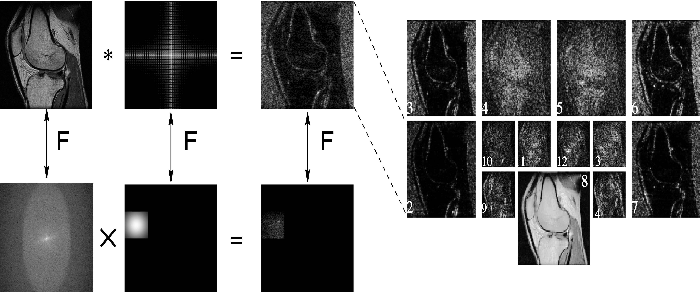
<br>
<br>
<br>
<h2>Results</h2>
<br>
<br>
<div align="center">

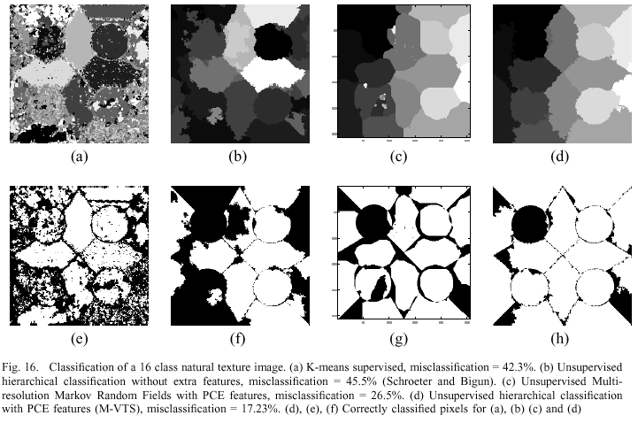
 <br>
</div>
<br>
<br>
<br>
<table align="center" border="1" cellpadding="2" cellspacing="2"
 width="80%">
<tbody>
<tr>
<td valign="top" width="50%"> Original Images (from Randen)<br>
<a href="http://www.ux.uis.no/%7Etranden/">http://www.ux.uis.no/~tranden/</a>

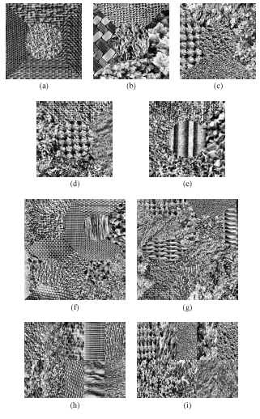
  <br>
</td>
<td valign="top" width="50%"> Classification with M-VTS<br>

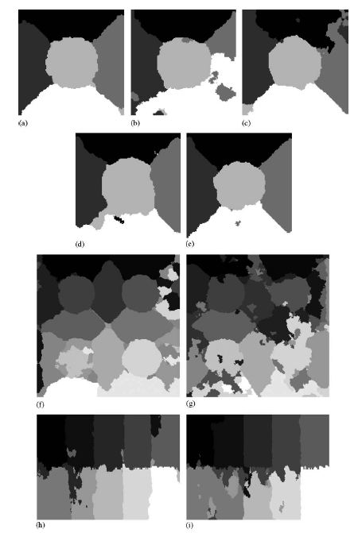
  <br>
</td>
</tr>
<tr>
<td valign="top" width="50%">Boundaries imposed in the original
images<br>
<br>

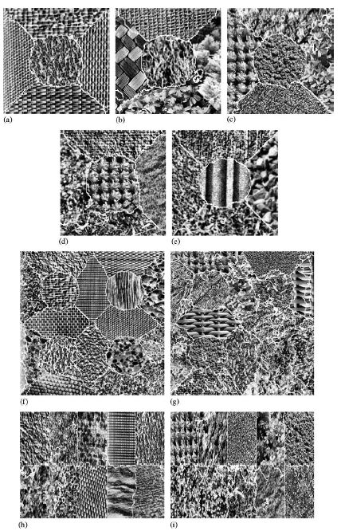
  <br>
</td>
<td valign="top" width="50%">Correctly classified pixels in white<br>
<br>

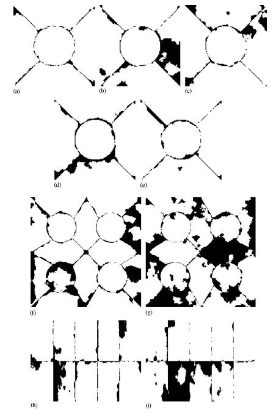
  <br>
</td>
</tr>
</tbody>
</table>
<br>

<div align="center"> <br>

<table border="1" cellpadding="2" cellspacing="2" width="80%">
<tbody>
<tr>
<td valign="top">

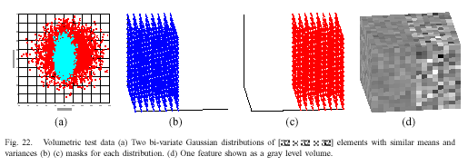
 <br>
</td>
</tr>
<tr>
<td valign="top">

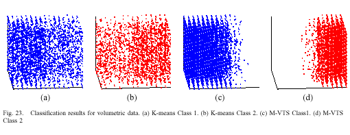
 <br>
</td>
</tr>
<tr>
<td valign="top">

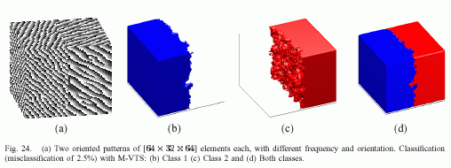
 <br>
</td>
</tr>
</tbody>
</table>
<br>
<br>
</div>
<br>
<br>

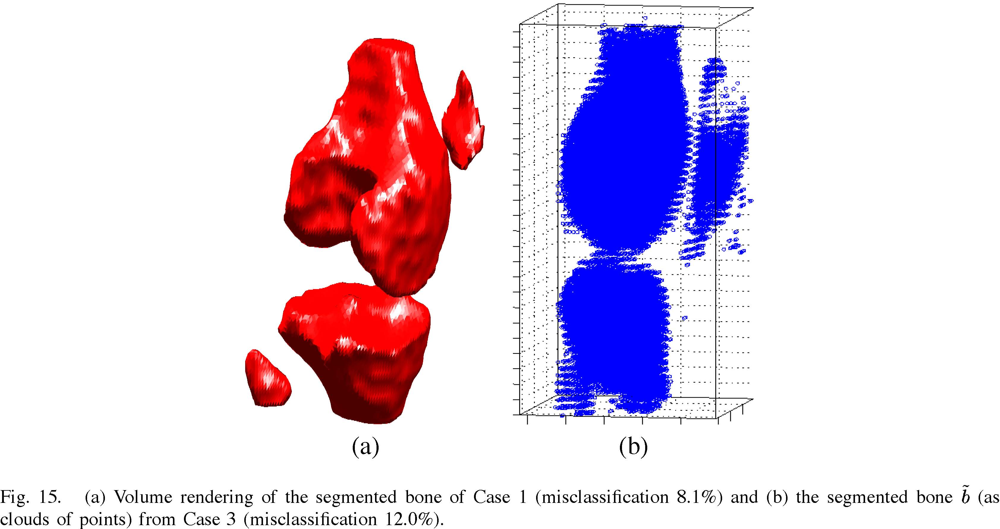
 <br>
<br>

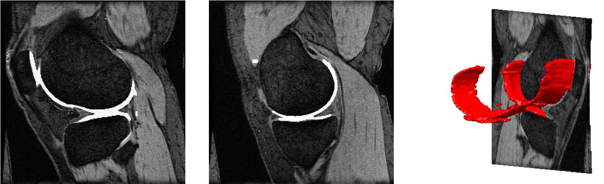
<br>
<br>
<br>
